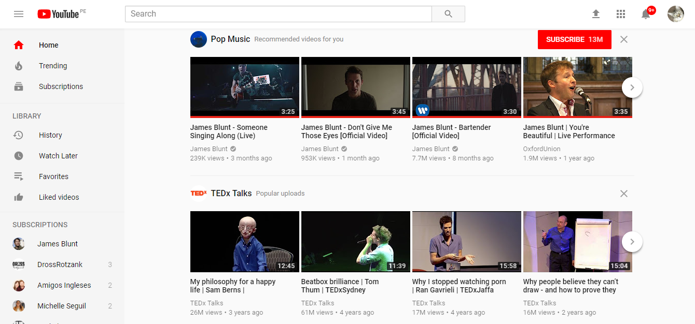
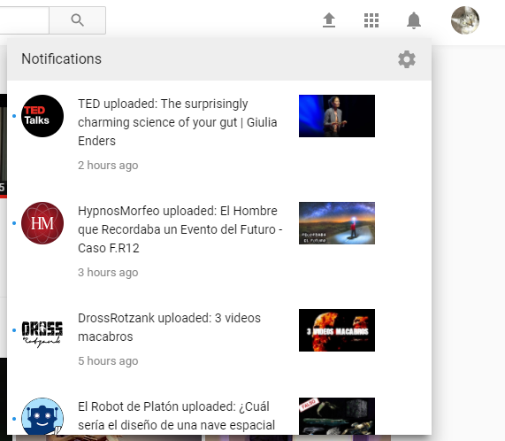
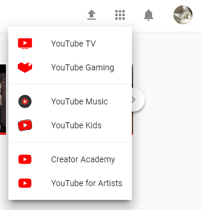
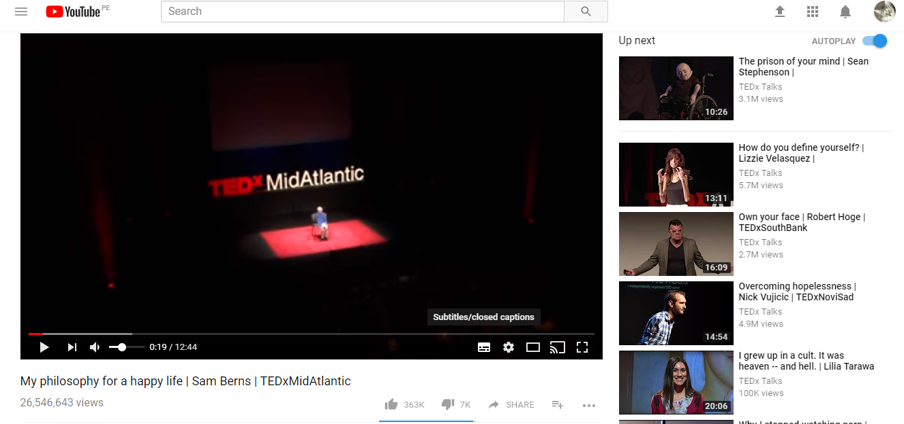
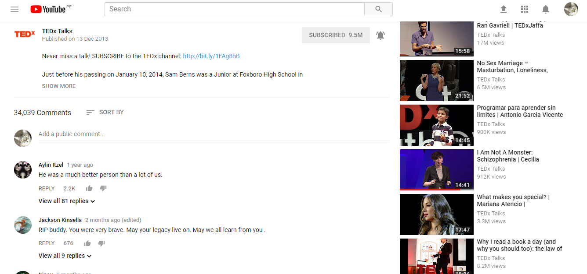

# **UX Challenge #1**

## **UX vs. UI**
----

### **1. Objetivo**

Explicar qué partes conforman el UX y el UI de la plataforma de Youtube.

### **2. Contenido**

***¿ Qué es UX?***

- Recibir sugerencias de videos basados en mi historial.

- Encontrar rápidamente el video que quiero.

- Poder suscribirme a canales de mi interés.

- Agregar a Watch later videos que quiero ver más adelante.

- Añadir videos a mis favoritos. 

- Acceder al trending de videos más populares.

- Poder configurar y personalizar mi cuenta personal.

- Subir videos y compartirlos.

- Añadir y eliminar videos de mi playlist.

- Poder reportar videos con contenido inapropiado.

- Recibir notificaciones de videos subidos recientemente.

- Tener acceso a las App's de Youtube (Gaming, Music, Tv, etc).

- Poder reproducir un video nuevamente, poner pausa, reanudar, cambiar el volumen, mostrar los subtítulos, ver en Full screen, play on Tv o cinema mode.

- Que la calidad de video se ajuste a la velocidad de internet.

- Poder activar y desactivar el autoplay.

- Dar like, unlike, comentar y compartir videos.

***¿ Qué es UI?***

- Colores del site (blanco, rojo, negro).

- Diseño de menús desplegables, links, ventanas, alertas, actualizaciones, campos de contraseña, campos de búsqueda.

- Diseño de barras de navegación, botones e íconos.

- Barra de play con tools: volumen, subtítulos, calidad y view mode.

- Barra de avance según el tiempo de reproducción del video.

- Forma y tamaño de los video frames.

### **3. Imágenes del site** 

    

